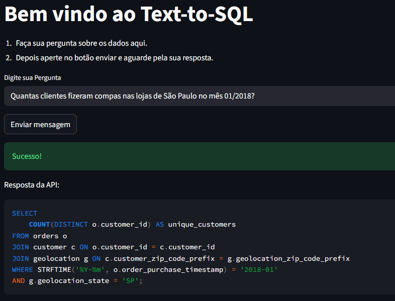

# Text-to-SQL com IA — Consulta Inteligente ao Banco Olist

Este projeto é uma solução prática e moderna para transformar **linguagem natural em SQL**, permitindo que usuários não técnicos consultem dados de forma autônoma, sem depender do time de dados.

A proposta une rapidez, acessibilidade e governança, reduzindo gargalos e democratizando o acesso à informação. Reduzindo alguns problemas, como:

- Usuários de negócio dependem de analistas para consultas simples.
- O time de dados fica sobrecarregado.
- A construção do Data Warehouse leva tempo.
- Há pouca autonomia para tomadas de decisão rápidas.

A solução proposta elimina esse gargalo.

---

## Contexto do Problema

De acordo com o planejamento
 - Diversos times dependem de analistas para consultas simples.
 - Há um gargalo operacional significativo.
 - A empresa deseja democratizar o acesso aos dados enquanto constrói seu DW.
 - Usuários não técnicos precisam consultar dados de forma autônoma.

---

## Visão Geral da Solução

A solução implementa um pipeline de Linguagem Natural → SQL → Resultado, apoiado por IA.

### Objetivo:

Permitir que qualquer usuário faça perguntas como:
“Quais são os 10 vendedores com maior faturamento no último mês?”
E receba:

 1. O SQL gerado automaticamente.
 2. O resultado da consulta (tabela).
 3. Um resumo executivo (opcional para futuras versões).

Apoio conceitual do planejamento:

 - SQL é texto → LLM pode gerar SQL desde que tenha bom contexto.
 - RAG (Vanna + ChromaDB) fornece o contexto de tabelas, DDL, Q&A e docs.
 - O pipeline é somente leitura, garantindo segurança.

---

## Fluxo Completo

1. **Usuário digita uma pergunta** no Streamlit.  
2. O backend (FastAPI) recebe a pergunta.  
3. O **Vanna + OpenAI** gera o SQL com base em:
   - Estrutura do banco (DDL)
   - Documentações
   - Exemplos (Q&A)
   - Prompt personalizado
4. O SQL é validado (somente leitura).
5. O sistema executa a consulta no SQLite.
6. O resultado volta para o usuário em formato de tabela.

---

## Organização do projeto

    ├── notebooks          <- Jupyter notebooks e Arquivos de teste
    │
    ├── references         <- Planejamento e material de suporte desenvolvido.
    │
    ├── src                <- Source code for use in this project.
    │   ├── backend/
    │   │   ├── arquivos_treinamento/
    │   │   │   ├── consulta_ddl.pkl
    │   │   │   ├── qa.pkl
    │   │   │   ├── documentations.pkl
    │   │   │   └── prompt.pkl
    │   │   ├── core/
    │   │   │   ├── main.py                 # API FastAPI
    │   │   │   ├── my_vanna_class.py       # Classe principal de configuração e treino
    │   │   │   └── vanna_client.py         # Inicializador/helper do Vanna
    │   │   ├── data/
    │   │   │   ├── db_olist.sqlite     # Banco Olist
    │   │   │   └── chroma.sqlite3      # Persistência do Chroma
    │   │   └── requirements.txt        # Requirementes exclusivo para o backend
    │   │
    │   └── frontend/
    │       ├── streamlit.py            # Interface do usuário
    |       └── requirements.txt        # Requirementes exclusivo para o frontend
    ├── LICENSE
    └── README.md

---

## Tecnologias Utilizadas

| Tecnologia | Função |
| ---------- | ------ |
| FastAPI | Backend, endpoints REST |
| Streamlit | Interface simples para o usuário final |
| Vanna AI | Motor Text-to-SQL com RAG |
| OpenAI API | Geração de SQL |
| ChromaDB | Vetorização de DDL, docs e Q&A |
| SQLite | Banco de testes (Olist) |
| Python | Toda a orquestração |

---

## Como Funciona o Text-to-SQL

1. Treinamento (leve) com RAG:
    - DDL extraída do SQLite
    - Documentações
    - Exemplos de perguntas/respostas (Q&A)
    - Prompt de sistema personalizado

2. Geração do SQL
    - Vanna cria o prompt → modelo OpenAI gera SQL estruturado

3. Validação
    - Apenas SELECT
    - Limitações de leitura
    - Proteção contra alucinações

4. Execução no SQLite
    - Resultado tabular
    - (Futuro) Resumo incremental

---

## Interface Streamlit

Interface simples com:

 - Campo para digitar a pergunta
 - Botão Enviar
 - Exibição do SQL gerado
 - Exibição dos resultados

Ideal para POCs, demos e testes internos. Estruturas pequenas de alfa test.

---

## Segurança e Boas Práticas

Mitigações definidas no planejamento:

 - Apenas SELECT
 - Limite de linhas (ex: LIMIT 500)
 - Máscara de PII
 - Log de requisições
 - Histórico de perguntas
 - Chaves API via variável de ambiente

---

## Aplicabilidades Reais

- Democratização de dados para squads não técnicos
- Autonomia para área financeira em análises diárias
- Suporte a times de Operações, Marketing e Produto
- Acesso a relatórios e dashboards via linguagem natural
- Redução do backlog de consultas repetitivas
- Auxílio ao time de Dados durante a construção do DW
- Auditorias internas rápidas (consultas específicas)

---

## Pontos de Melhoria

- Implementar camada de validação automática do SQL (linting)
- Acrescentar abordagem híbrida com modelos locais (Llama-3, Mistral)
- Criar summaries executivos dos resultados
- Expandir o catálogo de dados para melhorar o RAG
- Implementar logs estruturados + dashboards (Grafana/Loki)
- Criar histórico de perguntas por usuário
- Implementar controle de acesso (Auth + Roles)
- Adicionar “auto-refine” para melhorar SQL antes da execução
- Criar um worker para cache de consultas frequentes

---

## Testes

Não manterei o sistema em produção, pois cada envio de mensagem gera tokens e custos pessoais, então manterei aqui algumas imagens que representem o funcionamento do programa.

---

# Sobre mim

Olá! Meu nome é **Gabriel Nobre Galvão**, trabalho como **Ciêntista de Dados** desde 2021 e **IA Generativa** me divirto um pouco.

Trabalho criando soluções que unem dados, software e inteligência artificial para resolver problemas reais — como este projeto de Text-to-SQL.

### Onde me encontrar

- **LinkedIn:** [linkedin.com/in/gabriel-nobre-galvao](https://www.linkedin.com/in/gabriel-nobre-galvao/)
- **GitHub:** [github.com/Gabrielnbr](https://github.com/Gabrielnbr)
- **Portfólio:** [Portfólio de Projetos](https://gabriel-nobre-galvao.notion.site/Portf-lio-de-Projetos-em-Dados-51dd21d9aadb4a278f3f015992c92ee9?source=copy_link)

Se quiser conversar sobre IA, Data Science, produtos de dados ou oportunidades, estou sempre aberto!
